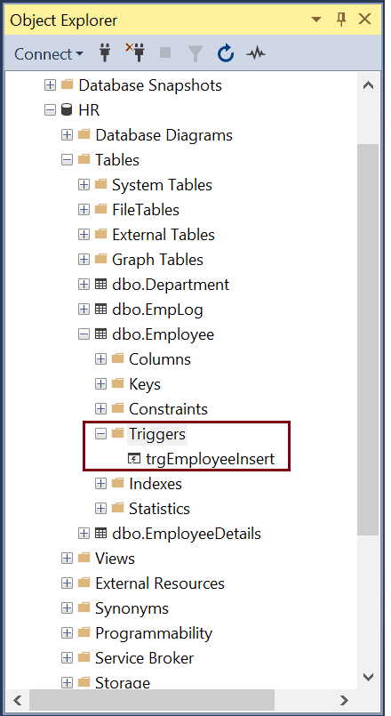
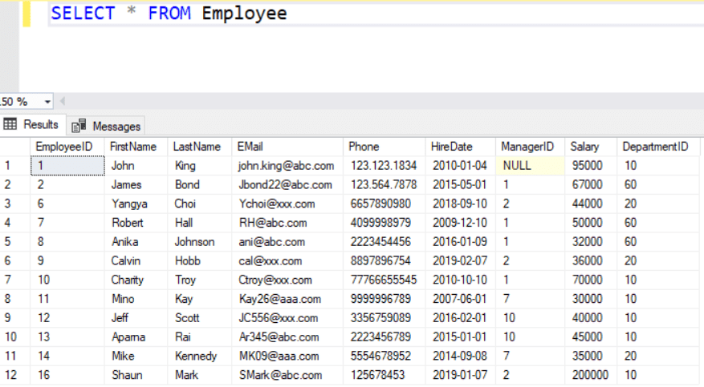
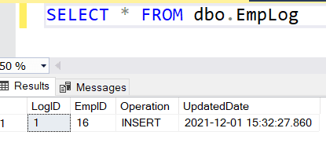
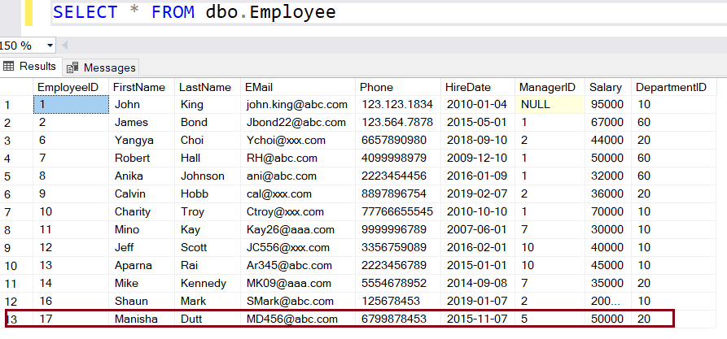
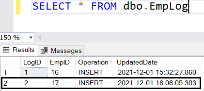
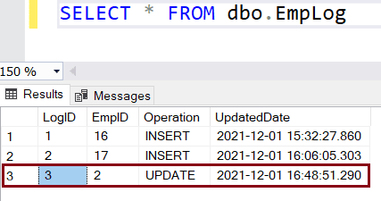
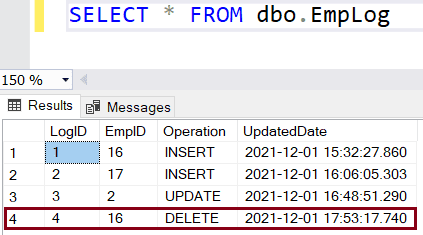

# Database Lab #4 - `Triggers In SQL Server`
### By TA `Ahmed Arafat` (>‿◠)✌

### Topics To Be Discussed:
   1. What are `Triggers` ?
   2. What are the types of `Triggers` ?
   3. `DML` `Triggers`
   4. Example On `Triggers`
      1. `FOR` Triggers
      2. `AFTER` Triggers
      3. `INSTEAD OF` Triggers
   5. `Disable`/`Drop` a Trigger
<hr>
<hr>

### 1. What are `Triggers` ?
- The `trigger` is a database object similar to a stored procedure that is
executed automatically when an event occurs in a database. 
  - There are different kinds of events that can activate a `trigger` like 
  `inserting` or `deleting` rows in a table, a user logging into a database 
  server instance, an update to a table column, a table is `created`, `altered`, or `dropped`, etc.

  - For example, consider a scenario where the salary of an employee in the `Employee` table is updated.
  You might want to preserve the previous salary details in a separate 
  `audit table` before it gets updated to its new value. 
  You can create a `trigger` to **automatically** insert employee data 
  to the new `audit` table whenever the Employee table's value is updated.

<hr>

### 2. What are the types of `Triggers` ?
- There are three types of triggers in `SQL Server`
  - `DML triggers` are automatically fired when an `INSERT`, `UPDATE` or `DELETE` event occurs on a table.
  - `DDL triggers` are automatically invoked when a `CREATE`, `ALTER`, or `DROP` event occurs in a database. It is fired in response to a server scoped or database scoped event.
  - `Logon trigger` is invoked when a LOGON event is raised when a user session is established.


### 3. `DML` Triggers
- `DML (Data Manipulation Language)` trigger is automatically 
invoked when an `INSERT`, `UPDATE` or `DELETE` statement is executed on a table.

Use the `CREATE TRIGGER` statement to create a trigger in `SQL Server` :
````sql
CREATE TRIGGER [schema_name.]trigger_name
ON { table_name | view_name }
{ FOR | AFTER | INSTEAD OF } {[INSERT],[UPDATE],[DELETE]}
[NOT FOR REPLICATION]
AS
    {sql_statements}
````

In the above syntax:

> `schema_name` (optional) is the name of the schema where the new trigger will be created.

> `trigger_name` is the name of the new trigger.

> `ON { table_name | view_name }` keyword specifies the 
`table` or `view` name on which the trigger will be created.

> `AFTER` clause specifies the `INSERT`, `UPDATE` or `DELETE` event 
which will fire the trigger. The `AFTER` clause specifies that
the trigger fires only after `SQL Server` successfully completes
the execution of the action that fired it. All other actions and constraints should be successfully executed before the trigger is fired.

> `INSTEAD OF` clause is used to skip an 
`INSERT`, `UPDATE` or `DELETE` statement to a table and 
instead, executes other statements defined in the trigger. 
So, the actual `INSERT`, `UPDATE` or `DELETE` statement does not happen at all.
`INSTEAD OF` clause cannot be used on `DDL` triggers.

> `NOT FOR REPLICATION` clause is specified to instruct the SQL Server not to invoke the trigger when a replication agent modifies the table.

> `sql_statements` specifies the action to be executed when an event occurs.


### DML triggers use two special temporary tables called `inserted` tables and `deleted` tables. 
### `SQL Server` automatically creates and manages these tables. SQL Server uses these tables to find the state of a table before and after a data modification and take action based on that difference.

#### 1. `INSERTED Table` : Holds the new rows to be inserted during an `INSERT`, No records for the `DELETE` statements

#### 2. `DELETED Table` : Holds copies of the affected rows during a `DELETE` or `UPDATE` event, No records for the `INSERT` statements.

### 4. Example On `Triggers`
<hr>

- Let's create a trigger that fires on `INSERT`, `UPDATE` and `DELETE` operation on the `Employee` table.
For that, create a new table `EmployeeLog` to log all operation performed on the `Employee` table.
````sql
CREATE TABLE EmpLog (
	LogID int IDENTITY(1,1) NOT NULL,
	EmpID int NOT NULL,
	Operation nvarchar(10) NOT NULL,
	UpdatedDate Datetime NOT NULL	
)
````
> `IDENTITY(1,1)` is like `AUTO_INCREMENT` in `MySQL`, `(1,1)` means that it will start from value `1` and each time
it will increment by `1`, example : 1, 2, 3, 4, etc ...

> In the above table, `LogID` is the serial number with `auto increment`, `UpdatedDate` is the date on which the Employee table was updated.
The Operation column stores the type of operation made to the table, either `INSERT`, `UPDATE`, or `DELETE`.

### 4.1 `FOR` Triggers
- The `FOR` triggers can be defined on tables or views.
It fires only when all operations specified in the triggering SQL statement have initiated successfully.
All referential cascade actions and constraint checks must
also succeed before this trigger fires.


- The following `FOR` trigger fires on the `INSERT` operation on the Employee table.
````sql
CREATE TRIGGER dbo.trgEmployeeInsert
ON dbo.Employee
FOR INSERT	
AS
    INSERT INTO dbo.EmpLog(EmpID, Operation, UpdatedDate)
    SELECT EmployeeID ,'INSERT',GETDATE() FROM INSERTED; --virtual table INSERTED
````
> The above `sql command` will create the `trgEmployeeInsert` trigger in the `<table_name>` in `Triggers folder`, as shown below.



- Now Execute the `select` statements on `Employee` and `EmpLog` tables to see the existing records.



- The following is `EmpLog` table.



- Now, execute the following `INSERT` statement that 
will `fire` the `trgEmployeeInsert` trigger.
````sql
INSERT INTO Employee(FirstName,LastName,EMail,Phone,HireDate,ManagerID,Salary,DepartmentID)
  VALUES('Manisha','Dutt','MD456@abc.com',6799878453,'11/07/2015',5,50000,20)
````
> The above will insert a new row in the `Employee` table, as shown below.



- The `trgEmployeeInsert` will be fired and `insert` a row in the `EmpLog` table, as shown below :



- You can see that a new row is inserted in the `EmpLog` table for each `INSERT` statement for the `Employee` table.

  - >Note: For any reason, if the `FOR triggers` fails then the `INSERT` will also fail and no rows will be inserted.

### 4.2 `AFTER` Triggers

- The `AFTER` trigger fires only after the specified triggering SQL statement completed successfully. 
> `AFTER` triggers cannot be defined on views.

- For example, the following trigger will be fired after each `UPDATE` statement on the Employee table.
````sql
CREATE TRIGGER dbo.trgEmployeeUpdate
ON dbo.Employee
AFTER UPDATE
AS
    INSERT INTO dbo.EmpLog(EmpID, Operation, UpdatedDate)
    SELECT EmployeeID,'UPDATE', GETDATE() FROM DELETED;
````
> To test this trigger, execute the following `UPDATE` statement :

````sql
UPDATE Employee
SET salary = 55000
WHERE EmployeeID = 2;
````
- Now, `select` rows from the `EmpLog` table. The `trgEmployeeUpdate` trigger should have inserted a new row in the `EmpLog` table, as shown below :



### 4.3 `INSTEAD OF` Triggers
- An `INSTEAD OF` trigger allows you to `override` the `INSERT`, `UPDATE`, or `DELETE` operations on a table or view.
The actual `DML` operations do not occur at all.

  - The `INSTEAD OF` `DELETE` trigger executes instead of the `actual delete` event on a table or view.
  In the `Instead Of delete trigger` example below,
  when a `delete` command is issued on the `Employee` table, a new row is created in the `EmpLog` table storing the operation as `'Delete'`, **but the row doesn't get deleted**.

````sql
CREATE TRIGGER dbo.trgInsteadOfDelete 
ON dbo.Employee
INSTEAD OF DELETE
AS
    INSERT INTO dbo.EmpLog(EmpID, Operation, UpdatedDate)
    SELECT EmployeeID,'DELETE', GETDATE() FROM DELETED;
````
- Now, execute the following `delete` statement to test the above trigger.
````sql
DELETE FROM Employee
WHERE EmployeeID = 16;
````
> The above statement will fire the `trgInsteadOfDelete` trigger which will insert a new row in the `EmpLog`
table instead of deleting a row in the `Employee` table.



### 5. `Disable`/`Drop` a trigger
- To disable a `trigger` (You can Enable it later) on `Locations` table
````sql
DISABLE TRIGGER TR_UPD_Locations2 on Locations
````

- To disable a All `triggers`  on `Locations` table
````sql
DISABLE TRIGGER ALL ON Locations 
````
- To drop a `trigger` (permanently)
````sql
DROP TRIGGER TRL_UPD_Locations2 
````

### Multiple Triggers
- In SQL Server, multiple triggers can be created on a table for the same event. There is no defined order of execution for these triggers.

  - The order of the triggers can be set to `First` or `Last` using the stored procedure `sp_settriggerorder`.

### Reference ^-^
[tutorialsteacher Article](https://www.tutorialsteacher.com/sqlserver/triggers)
