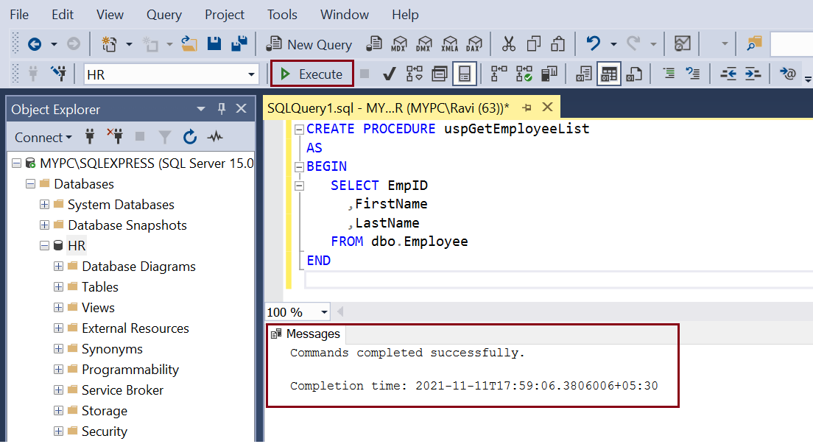
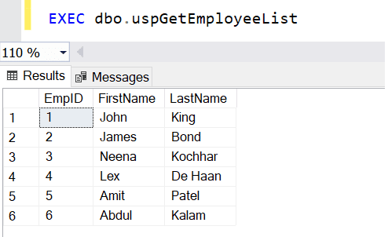
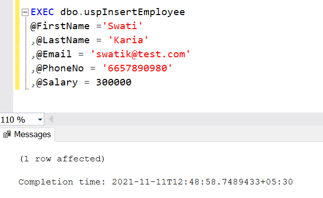
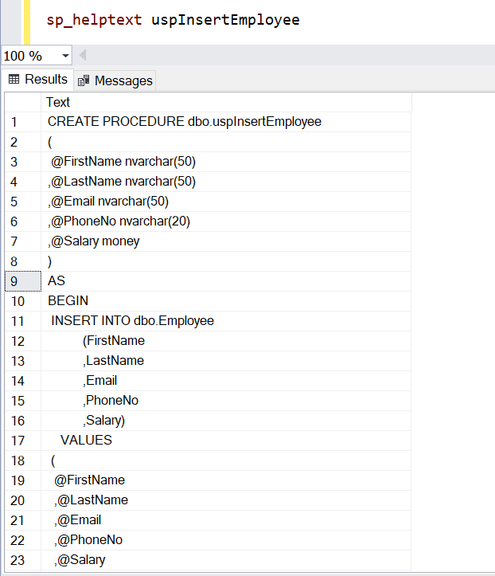
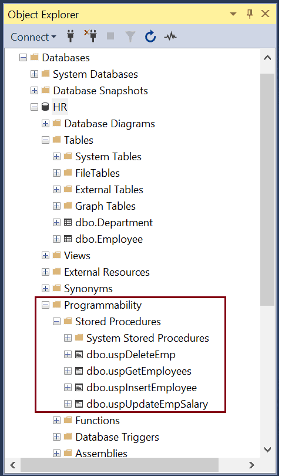

# Database Lab #5 (Final Lab) - `Stored Procedures`
### By TA `Ahmed Arafat` (>‿◠)✌


### Topics To Be Discussed:
1. What Are `stored procedures` ?
2. Advantages of `Stored procedures`
3. Create `Stored Procedure`
4. View `Stored Procedure`
5. Modify `Stored Procedure`
6. Rename `Stored Procedure`
7. Delete `Stored Procedure`


### 1. What Are `stored procedures` ?

- In SQL Server, a stored procedure is a set of `T-SQL` statements which is compiled and stored in the database. The stored procedure accepts input and output parameters, executes the SQL statements, and returns a result set if any.

- By default, a stored procedure compiles when it gets executed for the first time. It also creates an execution plan that is reused for subsequent executions for faster performance.

- A stored procedure is a prepared SQL code that you can save, so the code can be reused over and over again.

- So if you have an SQL query that you write over and over again, save it as a stored procedure, and then just call it to execute it.

- You can also pass parameters to a stored procedure, so that the stored procedure can act based on the parameter value(s) that is passed.


### 2. Advantages of `Stored procedures`
- Stored procedures are reusable. Multiple users in multiple applications can use the same Stored Procedure (SP)
- As SPs reside in the database, it reduces network traffic. Applications have to make a procedure call to the database and it communicates back to the user.
- Database objects are encapsulated within a stored procedure, and this acts as a security mechanism by restricting access to the database objects.
- Reduced development cost, easily modified, and increased readability.
- Improves performance. When a stored procedure is executed for the first time, the database processor creates an execution plan which is re-used every time this SP is executed.


- `Stored procedures` are of two types:
  - User-defined procedures: A User-defined stored procedure is created by a database user in a user-defined database or any System database except the resource database.
  - System procedures: System procedures are included with SQL Server and are physically stored in the internal, hidden Resource database and logically appear in the sys schema of all the databases.


### 3. Create `Stored Procedure`
Use the `CREATE` statement to create a stored procedure.

````sql
CREATE [OR ALTER] {PROC | PROCEDURE} Procedure_name([@parameter data_type])
    AS
    BEGIN
        sql_statements 
    END
````
- A stored procedure can contain one or more `select`, `insert`, `update`, or `delete` statements.
The following is an example of a simple stored procedure that returns the records from the `Employee` table using the `SELECT` query

````sql
CREATE PROCEDURE uspGetEmployeeList
AS
BEGIN
   SELECT EmpID ,FirstName,LastName
   FROM dbo.Employee
END
````
- Execute the above `T-SQL` script in the query editor to compile and create it in the database, as shown below :
 


- The above stored procedure can be executed using the `EXEC` keyword, as shown below.


- The following stored procedure inserts values in the `Employee` table.
````sql
CREATE PROCEDURE dbo.uspInsertEmployee
(
 @FirstName nvarchar(50)
,@LastName nvarchar(50)
,@Email nvarchar(50)
,@PhoneNo nvarchar(20)
,@Salary money
)
AS
BEGIN
	INSERT INTO dbo.Employee
           (FirstName
           ,LastName
           ,Email
           ,PhoneNo
           ,Salary)
    VALUES
	(
		@FirstName
		,@LastName
		,@Email
		,@PhoneNo
		,@Salary
	)
 END
````

- The above stored procedure can be used to insert values to the `Employee` table instead of the `INSERT` statement.
Values are passed as `parameters` to the stored procedure.
The `@` symbol is used as a `prefix` for `parameter variables`.

- You can execute the `uspInsertEmployee` stored procedure using the `EXEC` keyword, as shown below.

````sql
EXEC dbo.uspInsertEmployeeDetails
@FirstName ='Swati'
,@LastName = 'Karia'
,@Email = 'swatik@test.com'
,@PhoneNo = '6657890980'
,@Salary = 300000
````

- Specify each parameter separated by a comma while executing a stored procedure.



### 4. View Stored Procedure
- Use `sp_help` or `sp_helptext` to see the text of an existing stored procedure, as shown below.
  

- All the stored procedures are listed under `Programmability` > `Stored Procedures` folder under the database.

<p align="center">

</p>


### 5. Modify `Stored Procedure`

Use the `ALTER PROCEDURE` statement to modify a stored procedure.
````sql
ALTER PROCEDURE dbo.uspGetEmployees
AS
BEGIN
   SELECT EmpID
	 ,FirstName
	 ,LastName
     ,Salary
   FROM dbo.Employee
END
````

### 6. Rename `Stored Procedure`
- Use the system stored procedure `sp_rename` to rename an existing stored procedure. The following renames `uspGetEmployeeList` to `uspGetEmployees`.
````sql
sp_rename 'uspGetEmployeeList','uspGetEmployees' 
````

### 7. Delete `Stored Procedure`
Use the `DROP PROCEDURE` statement to delete a stored procedure
````sql
DROP PROCEDURE dbo.uspGetEmployees;
````

### Reference ^-^
[Click Me](https://www.tutorialsteacher.com/sqlserver/stored-procedures)
